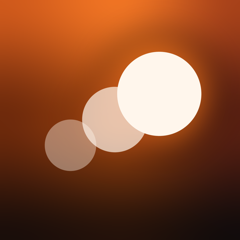
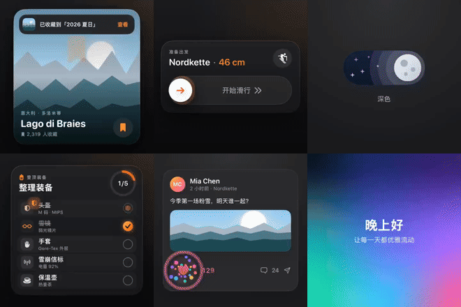

<div align="center">



# Motionary · 动效词典

**可以上手体验的 iOS 高级动效词典**<br>
**A hands-on dictionary of premium iOS motion**

<a href="https://alanfeiyuchang.github.io/motionary-ios-animations/"></a>

### 👉 [alanfeiyuchang.github.io/motionary-ios-animations](https://alanfeiyuchang.github.io/motionary-ios-animations/)


[](LICENSE)



</div>

---

做 App 时，脑子里有感觉却说不清：是弹簧还是缓动？回弹多少？只会说“来点高级感”，跟设计师、跟 AI 都讲不明白。
更难的是，你根本不知道 iOS 原生能做出哪些效果。

**Motionary** 把 **461 个真实运行的 SwiftUI 动效**按 15 个分类、85 个家族整理成一本词典：每个动效都能亲手按、拖、滑，
参数可以实时调，还配有**中英双语的专业提示词**，写清时长、曲线和弹簧参数，一键复制给 AI 或设计师，直接复现。

> You can feel a motion but can't describe it: spring or ease? How much bounce? "Make it feel premium" means nothing to a
> designer or an AI. And you may not even know what native iOS can do.
>
> **Motionary** is a dictionary of **461 real, running SwiftUI effects** in 15 categories and 85 families. Touch every one,
> tune its parameters live, and copy a **professional prompt written natively in Chinese and English** — durations,
> curves and spring values included — to hand to an AI or a designer.

## 两种打开方式 · Two ways in

| | |
|---|---|
| 🌐 **网页 · Web** — [在线预览全部动效录像](https://alanfeiyuchang.github.io/motionary-ios-animations/)：搜索、按分类浏览、看参数、复制提示词，打开就能用。<br>Browse every effect's recording, search, filter, read the parameters and copy prompts — nothing to install. | 📱 **App** — 在 iPhone 上亲手感受：真实手势、Taptic Engine 触感反馈、参数滑块实时生效。<br>Feel them on an iPhone: real gestures, Taptic Engine haptics, live parameter sliders. |

## 功能 · Features

- **461 个动效，15 个分类，85 个家族** · 461 effects in 15 categories and 85 families of variations
  (every slider, every spinner, every tab indicator…), compared side by side in **Compare** mode.
- **真实运行，不是视频** · Real SwiftUI, not video: tap, drag, pinch and scroll, with a reset button and Taptic Engine haptics.
- **参数实时可调** · Live parameters: sliders, toggles and segmented choices update the demo instantly.
- **中英双语专业提示词** · Native bilingual prompts: precise motion descriptions; the current parameter values are appended automatically. One tap to copy or share.
- **一搜即达** · Find anything: full-text search across names, summaries, APIs and bilingual tags, an interaction filter
  (tap / gesture / scroll / loop / state), favorites and a "surprise me" dice.
- **质感交互精选** · Signature Interactions: dark, tactile widget cards with rich micro-interactions.
- **iOS 26 Liquid Glass** where available, with graceful fallbacks; light / dark / system appearance; Chinese / English UI.

## 分类 · Categories

| 分类 | Category | 数量 |
|---|---|---:|
| 质感交互精选 | Signature Interactions | 32 |
| 按钮 | Buttons | 41 |
| 输入与控件 | Inputs & Controls | 45 |
| 加载与进度 | Loading & Progress | 36 |
| 反馈与提示 | Feedback & Alerts | 32 |
| 转场与形变 | Transitions & Morphing | 25 |
| 导航与菜单 | Navigation & Menus | 32 |
| 卡片 | Cards | 27 |
| 滚动与列表 | Scroll & Lists | 27 |
| 文字与数字 | Text & Numbers | 30 |
| 图标与符号 | Icons & Symbols | 25 |
| 手势与物理 | Gestures & Physics | 32 |
| 数据与图表 | Data & Charts | 25 |
| 背景与氛围 | Backgrounds & Ambience | 27 |
| 着色器与材质 | Shaders & Materials | 25 |

## 提示词长什么样 · What a prompt looks like

<details open>
<summary><b>昼夜切换开关 · Day / Night Toggle</b></summary>

> 大尺寸插画主题开关（180 × 76pt 胶囊）。白天：天蓝渐变轨道，左侧金色太阳旋钮由浅黄内核到深橙边缘的径向渐变、10 点钟方向高光和暖色外发光塑造立体感，外围三圈半透明同心光晕，右下铺着蓬松白云。点击后旋钮以弹簧（响应 0.6 秒、阻尼 0.78）边滚边转滑向右侧，填充由暖琥珀变为浅月灰并浮现三个陨石坑，光晕留作清冷月晕；轨道过渡为深藏青夜空，云朵下沉消失，五颗小星星以 60 毫秒错峰缩放出现并轻轻闪烁。再点则全部倒放。童趣而有电影感。

> A large illustrated theme switch (180 × 76 pt capsule). Day: a sky-blue gradient track, a golden sun knob on the left — given depth by a radial gradient from a pale-yellow core to a deep-orange rim, a soft specular highlight near 10 o'clock and a warm outer glow — wrapped in three concentric translucent halo rings, and white clouds resting along the bottom right. On tap the knob rolls to the right on a spring (response 0.6 s, damping 0.78), rotating as it travels while its fill shifts from warm amber to pale lunar gray and three craters fade in; the halo rings stay as a moonlit aura. The track crossfades to a deep navy night gradient, the clouds sink out of view, and five tiny stars scale in on the left with a 60 ms stagger and a gentle twinkle. Toggling back reverses it all. Whimsical and cinematic.

</details>

## 截图 · Screenshots

| 浏览 · Browse | 分类 · Category | 详情 · Detail |
|---|---|---|
|  |  |  |
|  |  |  |

全部页面与每个动效的截图 · Every screen and effect: [`docs/screenshots/`](docs/screenshots) · 验收报告 · Sign-off report: [`docs/SIGNOFF.md`](docs/SIGNOFF.md)

## 运行 · Run

需要 Xcode 16 或更新版本（推荐 Xcode 26，可看到 Liquid Glass 效果），部署目标 iOS 18.0+。
标注 **iOS 26** 的动效使用 Liquid Glass，在旧系统上自动降级。

Requires Xcode 16 or later (Xcode 26 recommended for Liquid Glass); iOS 18.0+ deployment target. Effects marked
**iOS 26** use Liquid Glass and fall back gracefully on older systems.

```bash
git clone https://github.com/alanfeiyuchang/motionary-ios-animations.git
cd motionary-ios-animations
open MotionLab.xcodeproj
```

选择 **MotionLab** scheme 和一台 iPhone 模拟器，⌘R 运行。项目使用 Xcode 16 的 *file-system synchronized groups*，
`MotionLab/` 下新增的文件会被自动编译（也附带了 XcodeGen 用的 `project.yml`）。

Pick the **MotionLab** scheme and an iPhone simulator, then ⌘R. Any file added under `MotionLab/` is compiled
automatically (Xcode 16 file-system synchronized groups); an optional `project.yml` for XcodeGen is included.

## 目录结构 · Project layout

```
MotionLab/
  App/            App entry + favorites store · 入口与收藏
  Core/           Effect model, parameters, localization, library, shared demo kit · 动效模型与共用组件
  Views/          Browse / Category / Search / Favorites / Settings / Detail · 各页面
  Effects/<Cat>/  One folder per category; each effect is an `Effect` + private demo view · 每个分类一个文件夹
  Families/       Families per category + effect → family membership · 动效家族
  Shaders/        Metal shaders ([[stitchable]]) for Shaders & Materials · 着色器
  Trailer/        The 75 s promo trailer, rendered live in the app · 宣传片
docs/EFFECT_GUIDE.md   How to add a new effect · 如何添加新动效
docs/FAMILIES.md       Family taxonomy · 家族分类
docs/TRAILER.md        Editing and recording the trailer · 宣传片的编辑与录制
scripts/               Site builder, recorders, CI helpers · 网站生成与录制脚本
```

## 添加新动效 · Adding an effect

见 [`docs/EFFECT_GUIDE.md`](docs/EFFECT_GUIDE.md)。简单说：用中英双语的名称、简介、提示词和实现说明创建 `Effect(...)`，
声明参数，写一个读取 `DemoContext` 的 demo 视图，加入分类的 `all` 列表，再在
`MotionLab/Families/<Category>Families.swift` 里加一行家族归属（见 [`docs/FAMILIES.md`](docs/FAMILIES.md)）。

See [`docs/EFFECT_GUIDE.md`](docs/EFFECT_GUIDE.md): create an `Effect(...)` with a bilingual name, summary, prompt and
implementation notes, declare its parameters, write a private demo view that reads `DemoContext`, add it to the
category's `all` list, and add one membership line in `MotionLab/Families/<Category>Families.swift`
(see [`docs/FAMILIES.md`](docs/FAMILIES.md)).

## 参考 · References

动效技术参考了 Apple WWDC（SwiftUI 动画、着色器、Liquid Glass）与社区文章 · Techniques were researched from Apple's WWDC
sessions and community write-ups, e.g.
[Advanced SwiftUI animations](https://medium.com/swift-pal/advanced-animations-in-swiftui-matchedgeometryeffect-timelineview-phaseanimator-beyond-2025-da8876b7b0b9),
[PhaseAnimator](https://www.appcoda.com/phaseanimator/),
[Metal shaders in SwiftUI](https://www.hackingwithswift.com/quick-start/swiftui/how-to-add-metal-shaders-to-swiftui-views-using-layer-effects),
[Liquid Glass reference](https://github.com/conorluddy/LiquidGlassReference).

## 许可 · License

[MIT](LICENSE) © 2026 Feiyu (Alan) Chang — 代码与提示词可自由使用、修改和分发，保留版权声明即可。
Free to use, modify and distribute, code and prompts alike, as long as the copyright notice is kept.

<div align="center">

**[→ 在线预览全部 461 个动效 · Browse all 461 effects online](https://alanfeiyuchang.github.io/motionary-ios-animations/)**

如果觉得有用，欢迎点个 ⭐ · If it helps, a ⭐ is appreciated.

</div>
