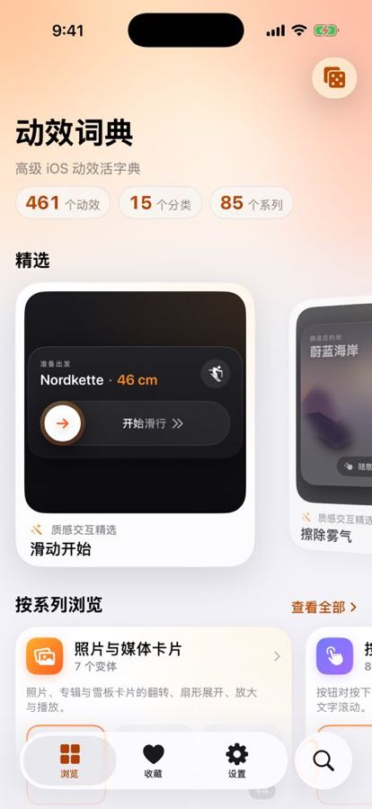
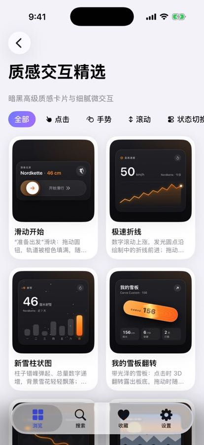
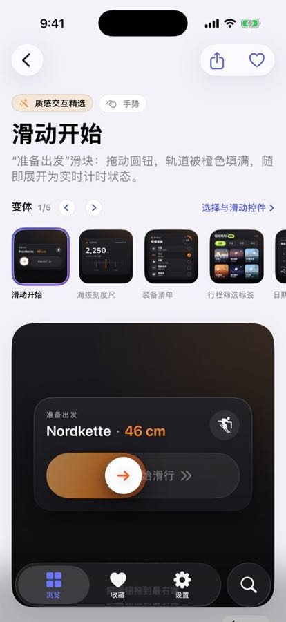
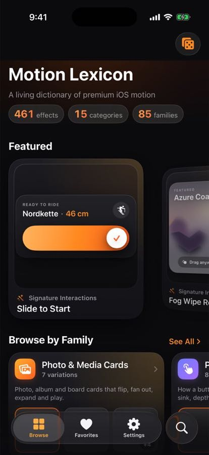
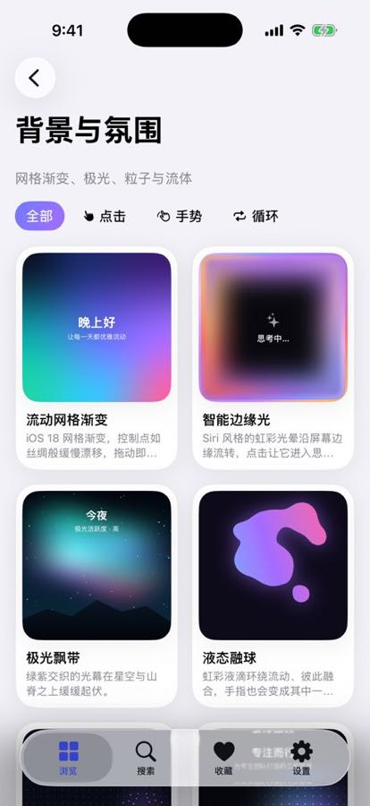
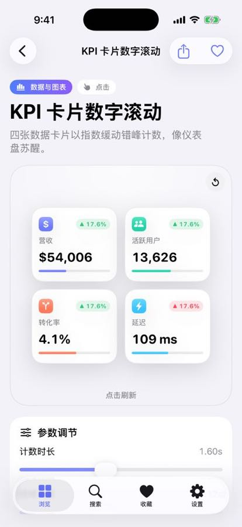

# Motion Lexicon · 动效词典

A native SwiftUI iOS app that works like a **dictionary of premium iOS motion effects**.
Every entry has a live preview, an interactive demo, tunable parameters, notes on how it's built,
and a professional **prompt** (written separately in English and Chinese) that describes the motion precisely.

一个原生 SwiftUI iOS 应用，像一本**高级 iOS 动效词典**。每个条目都包含实时预览、可交互 Demo、可调参数、
实现方式说明，以及一段中英文分别撰写、可精准描述该动效的**专业提示词**。

## Features · 功能

- **249 effects in 15 categories · 15 个分类共 249 个动效**: Signature Interactions (dark premium widget cards · 质感交互精选), Buttons, Inputs & Controls, Loading & Progress, Feedback & Alerts,
  Transitions & Morphing, Navigation & Menus, Cards, Scroll & Lists, Text & Numbers, Icons & Symbols,
  Gestures & Physics, Data & Charts, Backgrounds & Ambience, Shaders & Materials.
- **Live previews · 实时预览**: every card in a grid plays its own animation. Tap-driven demos autoplay in thumbnails.
- **Interactive demos · 可交互 Demo**: tap, drag, pinch, scroll — plus a reset button.
- **Parameters · 参数调节**: sliders, toggles and segmented choices update the demo live.
- **Prompts · 提示词**: native English/Chinese descriptions; the current parameter values are appended automatically.
  One-tap copy or share.
- **Findability · 易查找**: categories, secondary filter by interaction type (tap / gesture / scroll / loop / state),
  full-text search across names, summaries, APIs and bilingual tags, favorites, and a "surprise me" dice.
- **Bilingual UI · 中英双语**: switch language at runtime in Settings; light / dark / system appearance.
- **iOS 18 zoom navigation transition** from each card into its detail page.

## Screenshots · 截图

| Browse | Category | Detail |
|---|---|---|
|  |  |  |
|  |  |  |

All screens and every effect: [`docs/screenshots/`](docs/screenshots). Sign-off report: [`docs/SIGNOFF.md`](docs/SIGNOFF.md).

## Requirements · 环境要求

- Xcode 16 or later (Xcode 26 recommended to see Liquid Glass effects)
- iOS 18.0+ deployment target. Effects marked **iOS 26** use Liquid Glass with a graceful fallback on older systems.

## Run · 运行

```bash
open MotionLab.xcodeproj
```

Select the **MotionLab** scheme and an iPhone simulator, then ⌘R.
The project uses Xcode 16 *file-system synchronized groups*, so any file added under `MotionLab/` is compiled automatically.
(An optional `project.yml` for XcodeGen is also included.)

## Project layout · 目录结构

```
MotionLab/
  App/            App entry + favorites store
  Core/           Effect model, parameters, localization, library, shared demo kit
  Views/          Browse / Category / Search / Favorites / Settings / Detail screens
  Effects/<Cat>/  One folder per category; each effect is an `Effect` + private demo view
  Shaders/        Metal shaders ([[stitchable]]) used by the Shaders & Materials category
docs/EFFECT_GUIDE.md   How to add a new effect (conventions, prompt style, demo rules)
```

## Adding an effect · 添加新动效

See [`docs/EFFECT_GUIDE.md`](docs/EFFECT_GUIDE.md). In short: create `Effect(...)` with bilingual name, summary,
prompt and implementation notes, declare its parameters, write a private demo view that reads `DemoContext`,
and add it to the category's `all` list.

## References · 参考

Techniques were researched from Apple's WWDC sessions (SwiftUI animation, shaders, Liquid Glass) and community write-ups, e.g.
[Advanced SwiftUI animations](https://medium.com/swift-pal/advanced-animations-in-swiftui-matchedgeometryeffect-timelineview-phaseanimator-beyond-2025-da8876b7b0b9),
[PhaseAnimator](https://www.appcoda.com/phaseanimator/),
[Metal shaders in SwiftUI](https://www.hackingwithswift.com/quick-start/swiftui/how-to-add-metal-shaders-to-swiftui-views-using-layer-effects),
[Liquid Glass reference](https://github.com/conorluddy/LiquidGlassReference).
